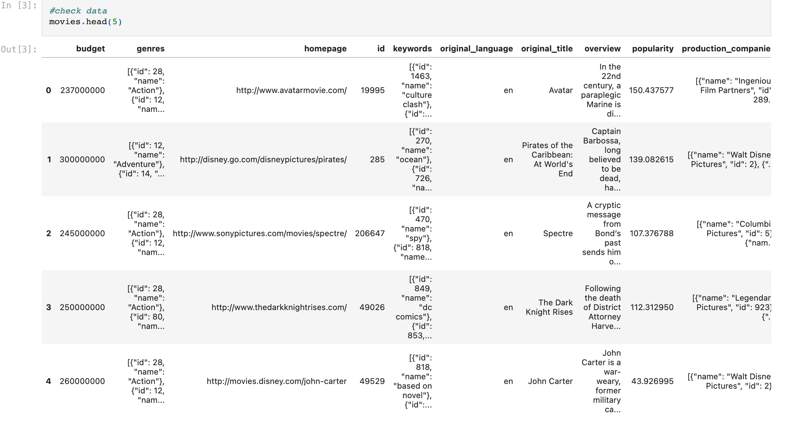
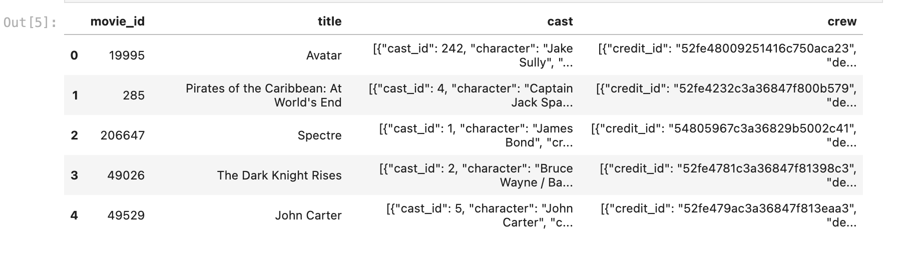

# Movie Recommendation - Group Project

## Introduction
When we click on a movie on Netfix to watch then it recommend us so many movies relate to the movie that we click on. We wondered ourself that how they can do that and what are the keys. These factors motivate our group to do this project for the Data Science Fundamental class.

The objective of this project is to practice using Jupiter Notebook. The movies recommendation are based on the content of the movie you entered or selected. The main parameters that are considered for the recommendations are the movie_id, the titles, and the tags. The tags of the movies include genres, keywords, overview, cast, crew. The details of the movies are fetched from 

## Selection of Data 
The model processing and training are conducted using Jupiter Notebook. 

There are two datasets:

  - tmdb_5000_movies.csv. This dataset includes 20 features such as 'budget', 'genres', 'homepage','id','keywords',...
  
  
  
  - tmdb_5000_credits.csv. This dataset includes 4 features such as 'movie_id', 'title', 'cast', 'crew'.

  
  

## Method 

## Results 

## Discussion 

## Summary 

A content-based recommender system that recommends movies similar to the movie the user enter

Check out the live demo: https://movies-recommender-vod6.herokuapp.com/

## Overview

The movies are recommended based on the content of the movie you entered or selected. The main parameters that are considered for the recommendations are the movie_id, the titles, and the tags. The tags of the movies include genres, keywords, overview, cast, crew. The details of the movies are fetched from [TMDB](https://developers.themoviedb.org/3/getting-started/introduction).

## How to get the API key?

Create an account in https://www.themoviedb.org/. Once you successfully created an account, click on the `API` link from the left hand sidebar in your account settings and fill all the details to apply for an API key. If you are asked for the website URL, just give "NA" if you don't have one. You will see the API key in your `API` sidebar once your request has been approved.

## How to run the project?

1. Clone or download this repository to your local machine.
2. Install all the libraries mentioned in the `requirements.txt` file with the command `pip install -r requirements.txt`
3. Get your API key from https://www.themoviedb.org/. (Refer the above section on how to get the API key)
4. Replace YOUR_API_KEY in `TMDB_API_KEY`
5. Open your terminal/command prompt from your project directory and run the file `app.py` by executing the command `streamlit run app.py`.
6. Hurray! That's it.

## Architecture

## Similarity Score :

**How does it decide which movie is most similar to the movie user enter(or selects)?** Here comes the similarity scores.

It is a numerical value ranges between zero to one which helps to determine how much two items are similar to each other on a scale of zero to one. This similarity score is obtained measuring the similarity between the text details of both of the items. So, similarity score is the measure of similarity between given text details of two items. This can be done by cosine-similarity.

## How Cosine Similarity works?

Cosine similarity is a metric used to measure how similar the documents are irrespective of their size. Mathematically, it measures the cosine of the angle between two vectors projected in a multi-dimensional space. The cosine similarity is advantageous because even if the two similar documents are far apart by the Euclidean distance (due to the size of the document), chances are they may still be oriented closer together. The smaller the angle, higher the cosine similarity.

More about Cosine Similarity : [Understanding the Math behind Cosine Similarity](https://www.machinelearningplus.com/nlp/cosine-similarity/)

### Sources

1. [IMDB 5000 Movie Dataset](https://www.kaggle.com/datasets/tmdb/tmdb-movie-metadata?select=tmdb_5000_movies.csv)
2. [Streamlit](https://docs.streamlit.io/)
